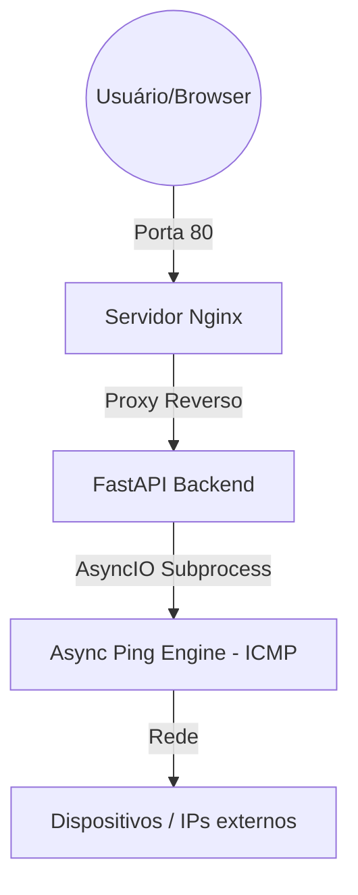

# MONITOR-262 (v3.0.0)

  

## 1. SOBRE O PROJETO

O Monitor-262 é uma ferramenta leve desenvolvida para monitorar a latência da sua rede local ou de serviços externos em tempo real.  

Ele foi desenhado para ser portátil e indestrutível, rodando totalmente via Docker.

## 2. ARQUITETURA

O sistema utiliza uma arquitetura de microserviços orquestrada, garantindo que o processamento de rede não bloqueie a interface do usuário.  

O monitoramento é realizado de forma assíncrona utilizando AsyncIO e subprocessos ICMP (ping), medindo o tempo de resposta dos alvos configurados e classificando o estado conforme limiares de latência.  

Novas medições são realizadas a cada 1500 ms, permitindo visualização contínua do comportamento da rede sem sobrecarga excessiva.  

## 3. ESTRUTURA DE PASTAS

/  
|-- api/                -> Lógica em Python e arquivo de alvos (ips.txt)  
|-- interface/          -> Painel visual (HTML/JS)  
|-- nginx/              -> Configurações do servidor de rede  
|-- docker-compose.yaml -> Comando de inicialização do sistema  
`-- README.md           -> Este manual de instruções

## 4. COMO INSTALAR

Existem duas formas de colocar o sistema para rodar:

### OPÇÃO A: Instalação Padrão (Via Internet)
Use esta opção se você tem conexão com a rede para baixar as imagens base.
No terminal, dentro da pasta do projeto, execute:
   
   docker compose up -d --build

### OPÇÃO B: Contingência (Offline / Sem Internet)
Use esta se a Opção A falhar ou se o servidor estiver isolado. 
Certifique-se de que o arquivo 'monitor-offline-v3.0.0.tar' está na pasta.
1. Carregue o motor do sistema:
   docker load -i monitor-offline-v3.0.0.tar
2. Inicie o sistema:
   docker compose up -d

## 5. MANUTENÇÃO E AJUSTES (MODO LIVE)

O sistema utiliza Volumes do Docker, permitindo alterações sem "parar a máquina":
- **CONFIGURAÇÃO DE ALVOS:** edite e salve o 'api/ips.txt'. As alterações são exibidas imediatamente. 
- **LÓGICA:** edite e salve 'api/main.py'. As alterações são exibidas imediatamente.
- **VISUAL:** edite e salve 'interface/index.html'. Dê F5 no navegador.
- **REDE:** edite e salve 'nginx/nginx.conf', rode: docker compose restart nginx-service

## 6. ACESSO

**Painel visual:** http://localhost  
(Interface demonstrada no início)  
🟢 -> até 300 ms  
🟡 -> entre 301 ms e 800 ms  
🔴 -> acima de 800 ms ou offline  

**Dados brutos:** http://localhost/status

## 7. INFRAESTRUTURA

Ambiente isolado garantindo que o backend (FastAPI) e o frontend (Nginx) rodem de forma independente.

---
**Desenvolvido por:** Caio Ferraz