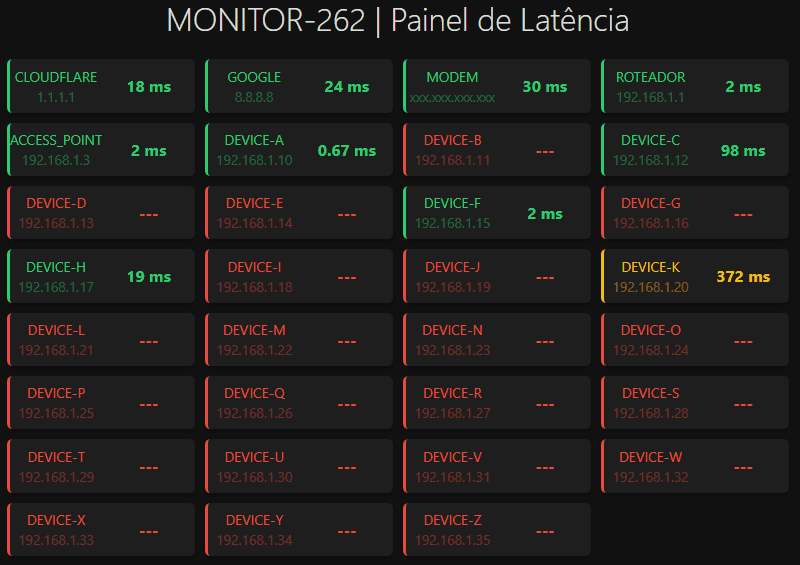
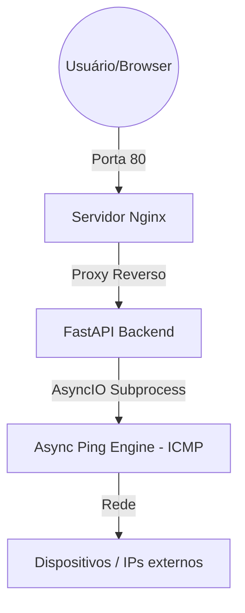
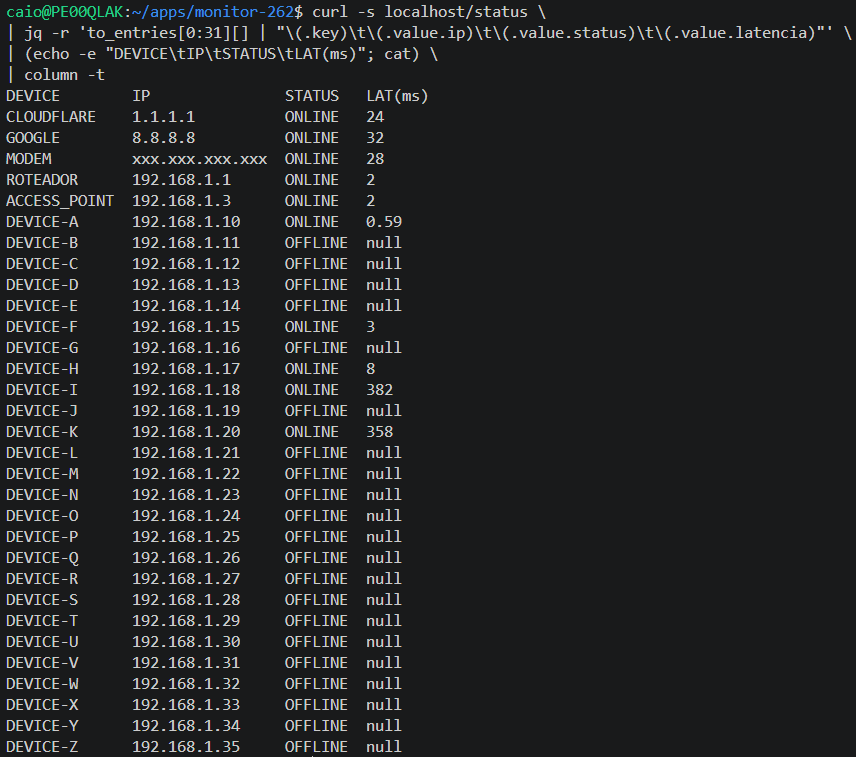
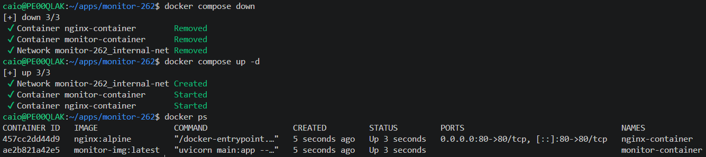

# MONITOR-262 (v3.0.0)
### Veja sua rede respirando, com 1 comando.

<p align="center">
  
</p>

## 1. SOBRE O PROJETO

Sistema leve desenvolvido para permitir a visualização simultânea da latência de múltiplos dispositivos, facilitando a identificação rápida de padrões de comportamento de rede.

Reduz o tempo de diagnóstico em cenários onde ferramentas tradicionais exigem testes manuais sequenciais.

Desenhado para ser fácil de reproduzir em qualquer ambiente, rodando totalmente via Docker.

## 2. ARQUITETURA

O sistema utiliza uma arquitetura de microserviços orquestrada, garantindo que o processamento de rede não bloqueie a interface do usuário.  

O monitoramento é assíncrono (AsyncIO + ICMP), garantindo alta precisão sem travar o sistema.

O estado de cada alvo é classificado em tempo real conforme os parâmetros.  

<details>
<summary><b>Diagrama</b></summary>


</details>

## 3. COMO INSTALAR (2 opções)

Requisito único: **Docker Desktop** (Windows / macOS) | **Docker Engine** (Linux)

### **Opção 1: Online** (download ou git)
  
**download**

1. Botão verde **Code** > **Download ZIP** 
2. Extraia o **.zip** e acesse a pasta via terminal
3. Execute: 
```bash
docker compose up -d --build
```

**git**

1. Abra o terminal 
2. Execute:  
```bash
git clone https://github.com/caiorferraz/monitor-262
cd monitor-262
docker compose up -d --build
```

### **Opção 2: Offline** (disponibilidade perpétua) 

1. Acesse **Releases** e baixe:
**Source code (zip)** e **monitor-offline-v3.0.0.tar**
2. Copie ambos para a máquina offline via pen drive
3. Extraia o **.zip**, deixe o **.tar** na raiz e acesse a pasta via terminal 
4. Execute: 
```bash
docker load -i monitor-offline-v3.0.0.tar
docker compose up -d
```

## 4. ACESSO

### **Frontend:** http://localhost  

🟢 -> até 300 ms  
🟡 -> entre 301 ms e 800 ms  
🔴 -> acima de 800 ms ou offline  

### **Backend:** http://localhost/status  

<details>
<summary><b>Ver</b></summary>


</details>  

### **Cada serviço no seu container**
<details>
<summary><b>Ver</b></summary>


</details>

## 5. MANUTENÇÃO E AJUSTES (hot reload)

- **CONFIGURAÇÃO DE ALVOS:** edite e salve o api/**ips.txt**. Alterações exibidas imediatamente. 
- **LÓGICA:** edite e salve api/**main.py**. Alterações exibidas imediatamente.
- **VISUAL:** edite e salve interface/**index.html**. F5 no navegador para ver as alterações.
- **REDE:** edite e salve nginx/**nginx.conf**. Execute: 
```bash
docker compose restart nginx-service
```

## 6. ESTRUTURA DE PASTAS

/  
|-- api/                -> Lógica em Python e arquivo de alvos (ips.txt)  
|-- interface/          -> Painel visual (HTML/JS)  
|-- nginx/              -> Configurações do servidor de rede  
|-- docker-compose.yaml -> Comando de inicialização do sistema  
`-- README.md           -> Este manual de instruções

---
#### **Desenvolvido por:** Caio Ferraz