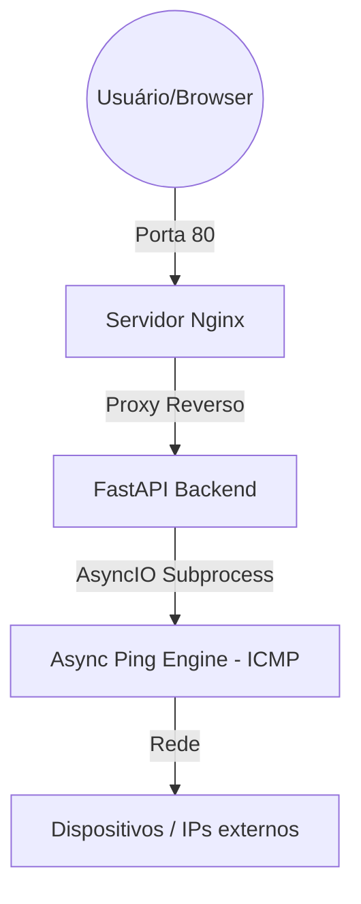

# MONITOR-262 (v2.1.2)

## 1. SOBRE O PROJETO

O Monitor-262 é uma ferramenta leve desenvolvida para monitorar a latência da sua rede local ou de serviços externos em tempo real.  
O monitoramento é realizado de forma assíncrona utilizando AsyncIO e subprocessos ICMP (ping), medindo o tempo de resposta dos alvos configurados e classificando o estado conforme limiares de latência.  
Ele foi desenhado para ser portátil e indestrutível, rodando totalmente via Docker.

## 2. ARQUITETURA DO SISTEMA

O sistema utiliza uma arquitetura de microserviços orquestrada, garantindo que o processamento de rede não bloqueie a interface do usuário.  
Novas medições são realizadas a cada 1500 ms, permitindo visualização contínua do comportamento da rede sem sobrecarga excessiva.

## 3. ESTRUTURA DE PASTAS

/  
|-- api/                -> Lógica em Python e arquivo de alvos (ips.txt)  
|-- interface/          -> Painel visual (HTML/JS)  
|-- nginx/              -> Configurações do servidor de rede  
|-- docker-compose.yaml -> Comando de inicialização do sistema  
`-- README.md           -> Este manual de instruções

## 4. COMO INSTALAR

Existem duas formas de colocar o sistema para rodar:

### OPÇÃO A: Instalação Padrão (Via Internet)
Use esta opção se você tem conexão com a rede para baixar as imagens base.
No terminal, dentro da pasta do projeto, execute:
   
   docker compose up -d --build

### OPÇÃO B: Contingência (Offline / Sem Internet)
Use esta se a Opção A falhar ou se o servidor estiver isolado. 
Certifique-se de que o arquivo 'monitor-offline-v2.1.2.tar' está na pasta.
1. Carregue o motor do sistema:
   docker load -i monitor-offline-v2.1.2.tar
2. Inicie o sistema:
   docker compose up -d

## 5. CONFIGURAÇÃO DE ALVOS (IPS.TXT)

Você define quem o Monitor-262 deve vigiar:
1. Acesse a pasta 'api/' e abra o arquivo 'ips.txt'.
2. Adicione ou altere os IPs conforme sua necessidade.
3. Não precisa reiniciar: assim que você salvar, os novos alvos aparecerão no painel, pois o sistema lê o arquivo em tempo real.

## 6. MANUTENÇÃO E AJUSTES (MODO LIVE)

O sistema utiliza Volumes, permitindo alterações sem "parar a máquina":
- Visual: Altere e salve 'index.html' em 'interface/'. Dê F5 no navegador.
- Lógica: Altere e salve 'main.py' em 'api/'. O sistema recarrega sozinho.
- Rede: Se alterar o 'nginx.conf', rode: docker compose restart nginx-service

## 7. ACESSO

Após iniciar, abra o seu navegador e acesse: http://localhost

## 8. ENDPOINT DE STATUS

O sistema disponibiliza um endpoint interno para verificação de estado:

http://localhost/status

Retorna informações sobre os alvos monitorados e o estado atual do sistema.

## 9. CLASSIFICAÇÃO DE ESTADO

Verde    -> até 300 ms  
Amarelo  -> entre 301 ms e 800 ms  
Vermelho -> acima de 800 ms ou offline

---
**Desenvolvido por:** Caio Ferraz