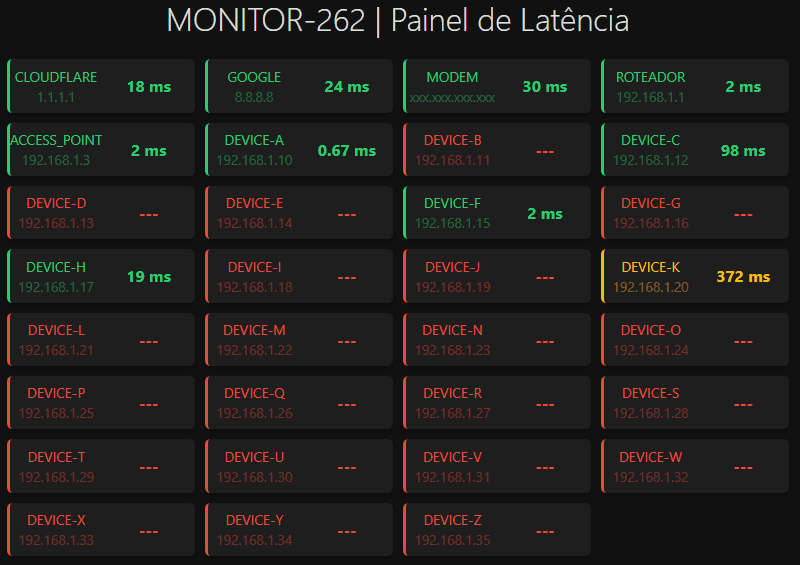
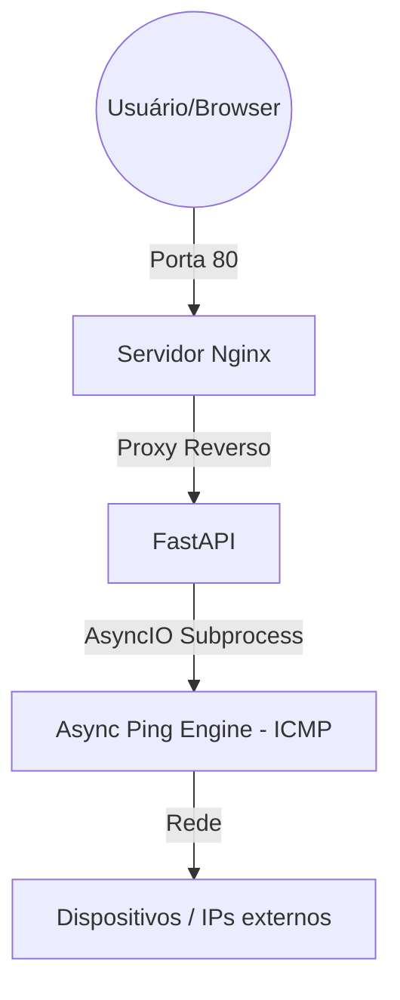
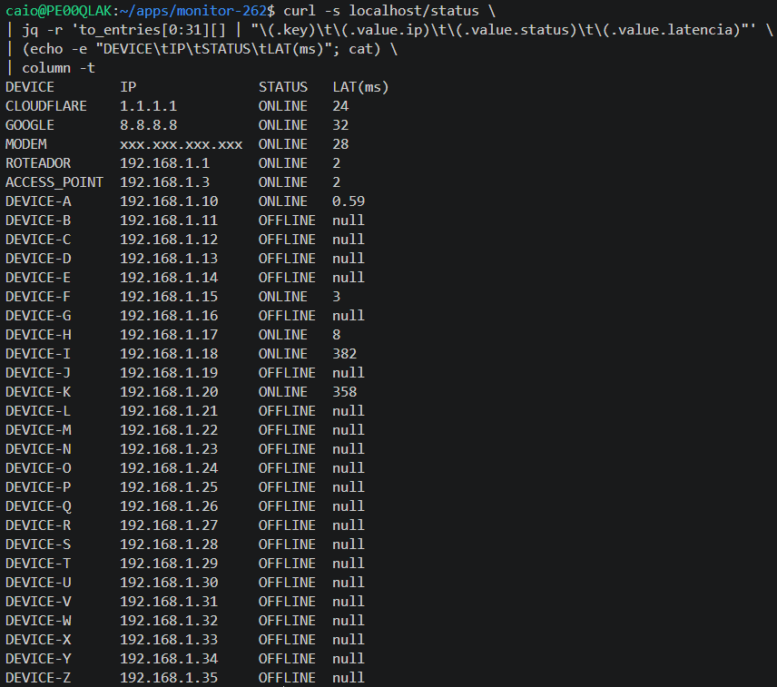
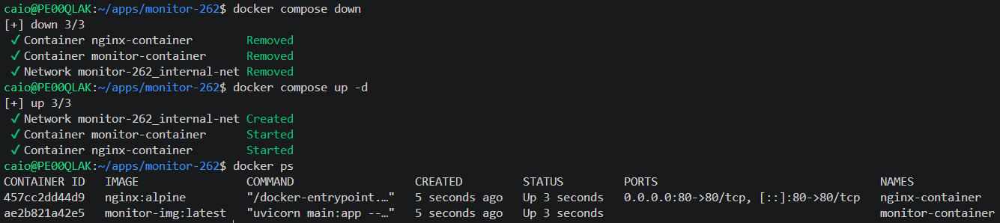

# MONITOR-262
### Veja sua rede respirando, com 1 comando.

<p align="center">
  
</p>

## 1. SOBRE O PROJETO

Sistema leve desenvolvido para permitir a visualização simultânea da latência de múltiplos dispositivos, facilitando a identificação rápida de padrões de comportamento de rede.

Reduz o tempo de diagnóstico em cenários onde ferramentas tradicionais exigem testes manuais sequenciais.

Desenhado para ser fácil de reproduzir em qualquer ambiente, rodando totalmente via Docker.

## 2. ARQUITETURA

Utiliza uma arquitetura de microserviços orquestrada, garantindo que o processamento de rede não bloqueie a interface do usuário.  

O monitoramento é assíncrono (AsyncIO + ICMP), garantindo alta precisão sem travar o sistema.

Cada alvo é classificado em tempo real conforme os parâmetros.  

<details>
<summary><b>Diagrama</b></summary>


```mermaid
graph TD
    User((Usuário/Browser)) -->|Porta 80| Nginx[Servidor Nginx]
    Nginx -->|Proxy Reverso| API[FastAPI]
    API -->|AsyncIO Subprocess| Engine[Async Ping Engine - ICMP]
    Engine -->|Rede| Alvos[Dispositivos / IPs externos]
```
</details>

## 3. COMO INSTALAR (2 opções)

Requisito único: **Docker Desktop** (Windows / macOS) | **Docker Engine** (Linux)

### **Opção 1: Online**
A partir do clone ou download do repositório. O Docker utilizará a conexão para baixar a imagem oficial do Nginx e instalar as dependências.

**git**

1. Abra o terminal e execute:  
```bash
git clone https://github.com/caiorferraz/monitor-262
cd monitor-262
docker compose up -d --build
```

**download**

1. Botão verde **Code** > **Download ZIP** 
2. Extraia o **.zip** e acesse a pasta via terminal
3. Execute: 
```bash
docker compose up -d --build
```

### **Opção 2: Offline** 
Usa as imagens pré-carregadas e não tem dependências. Garante a autonomia perpétua do sistema, rodando em ambientes totalmente isolados e sem internet.

1. Em **Releases**, baixe o
**Source code** e o arquivo **.tar**
2. Copie ambos para a máquina offline via pen drive
3. Extraia o **.zip**, deixe o **.tar** na raiz e acesse a pasta via terminal 
4. Execute: 
```bash
docker load -i monitor-vX.x.x.tar
docker compose up -d
```

## 4. ACESSO

### **Frontend:** http://localhost  

🟢 -> até 299 ms  
🟡 -> entre 300 ms e 899 ms  
🔴 -> 900 ms ou mais / offline  

### **Backend:** http://localhost/status  

<details>
<summary><b>Ver</b></summary>


</details>  

### **Cada serviço no seu container**
<details>
<summary><b>Ver</b></summary>


</details>

## 5. MANUTENÇÃO E AJUSTES (hot reload)

- **CONFIGURAÇÃO DE ALVOS:** Edite api/**ips.txt** (aplicado imediatamente). 
- **LÓGICA:** Edite api/**main.py** (aplicado imediatamente).
- **VISUAL:** Edite interface/**index.html** (F5 no navegador).

## 6. ESTRUTURA DE PASTAS

```text
├── api/                # Backend  
├── interface/          # Frontend  
├── nginx/              # Servidor de rede  
├── docker-compose.yaml # Inicialização  
└── README.md           # Este manual
```
---
#### **Desenvolvido por:** Caio Ferraz